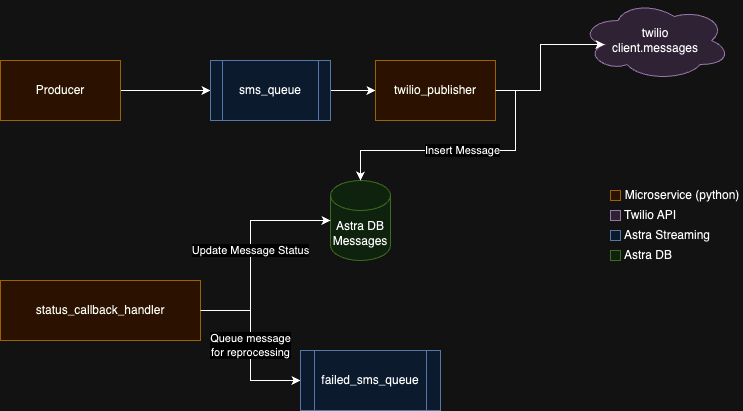

# Astra Streaming and Astra DB Sample

This sample shows how Astra Streaming (Managed Apache Pulsar) and Astra DB (Managed Apache Cassandra) can be used to queue and persist SMS messages sent using Twilio API.




## Prerequisites:

- An [Astra Streaming](https://www.datastax.com/products/astra-streaming) tenant, and topic created.
- A Google Cloud project with Cloud Functions API enabled.
- The Google Cloud CLI installed and configured with your project.
- Python 3.7 or higher installed on your local machine.
- A twilio account and token.

## Steps:

1. Set environment variables: Update the extension of `.env.template` and add values for all expected environment variables.

2. Create the `messages` table in Astra DB by running the DDL in `create_table.sql`.

3. Update the contents of `sample_messages.json` with phone numbers, and messages to be tested.

4. Deploy the Cloud Function that will server as the `status_callback_handler`. The function expects the Secure Connect Bundle and Astra DB Token to be inside the `cloud_functions` folder, and environment variables `PATH_TO_SCB` and `PATH_TO_TOKEN` pointing to them.

    ```bash
    gcloud functions deploy status_callback_handler \
    --runtime python39 \
    --entry-point main.status_handler \
    --trigger-http \
    --allow-unauthenticated \
    --set-env-vars PATH_TO_SCB="$PATH_TO_SCB",PATH_TO_TOKEN="$PATH_TO_TOKEN"
    ```

5. Update `TWILIO_CALLBACK_URL` with the URL of the cloud function you just deployed.

6. Execute the producer.

    ```bash
    python3 producer.py
    ```

7. Execute the twilio_publisher.

    ```bash
    python3 twilio_publisher.py
    ```

